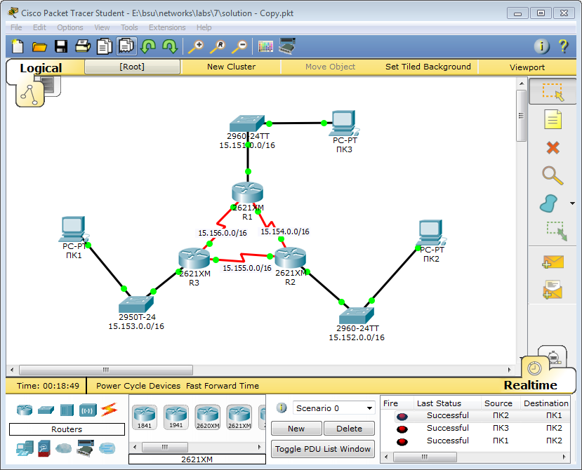

```
Router#sh ip route 
Codes: C - connected, S - static, I - IGRP, R - RIP, M - mobile, B - BGP
       D - EIGRP, EX - EIGRP external, O - OSPF, IA - OSPF inter area
       N1 - OSPF NSSA external type 1, N2 - OSPF NSSA external type 2
       E1 - OSPF external type 1, E2 - OSPF external type 2, E - EGP
       i - IS-IS, L1 - IS-IS level-1, L2 - IS-IS level-2, ia - IS-IS inter area
       * - candidate default, U - per-user static route, o - ODR
       P - periodic downloaded static route

Gateway of last resort is not set

     15.0.0.0/16 is subnetted, 6 subnets
O       15.151.0.0 [110/65] via 15.156.0.1, 00:01:12, Serial0/0
O       15.152.0.0 [110/65] via 15.155.0.1, 00:00:33, Serial0/1
C       15.153.0.0 is directly connected, FastEthernet0/0
O       15.154.0.0 [110/128] via 15.155.0.1, 00:03:37, Serial0/1
                   [110/128] via 15.156.0.1, 00:03:37, Serial0/0
C       15.155.0.0 is directly connected, Serial0/1
C       15.156.0.0 is directly connected, Serial0/0
```

```
PC>tracert 15.152.0.4

Tracing route to 15.152.0.4 over a maximum of 30 hops: 

  1   0 ms      0 ms      0 ms      15.151.0.2
  2   0 ms      1 ms      1 ms      15.154.0.2
  3   0 ms      0 ms      1 ms      15.152.0.4

Trace complete.

:: after changing s 0/1 ospf cost to 512 (initially was 64)

PC>tracert 15.152.0.4

Tracing route to 15.152.0.4 over a maximum of 30 hops: 

  1   1 ms      0 ms      0 ms      15.151.0.2
  2   1 ms      1 ms      0 ms      15.156.0.2
  3   0 ms      0 ms      1 ms      15.154.0.2
  4   0 ms      1 ms      0 ms      15.152.0.4

Trace complete.
```

