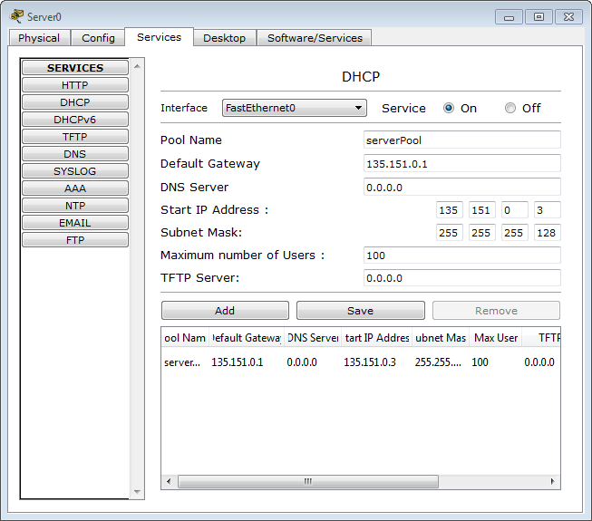

|Network|Nodes count|Address/Mask|
|-|-|-|
|1|100	|135.151.0.0/25		|
|2|50	|135.151.0.128/26	|
|3|2	|135.151.0.192/30	|  

`dhcp ip address: 135.151.0.2`

```
:: R1
int f 0/0
ip address 135.151.0.129 255.255.255.192
no shutdown
exit

int s 0/0
ip address 135.151.0.193 255.255.255.252
no shutdown
exit

router ospf 1
network 135.151.0.194 0.0.0.3 area 1
network 135.151.0.128 0.0.0.63 area 1
exit

:: R2
int f 0/0
ip address 135.151.0.1 255.255.255.128
no shutdown
exit

int s 0/0
ip address 135.151.0.194 255.255.255.252
no shutdown
exit

router ospf 1
network 135.151.0.193 0.0.0.3 area 1
network 135.151.0.0 0.0.0.127 area 1
exit
```

