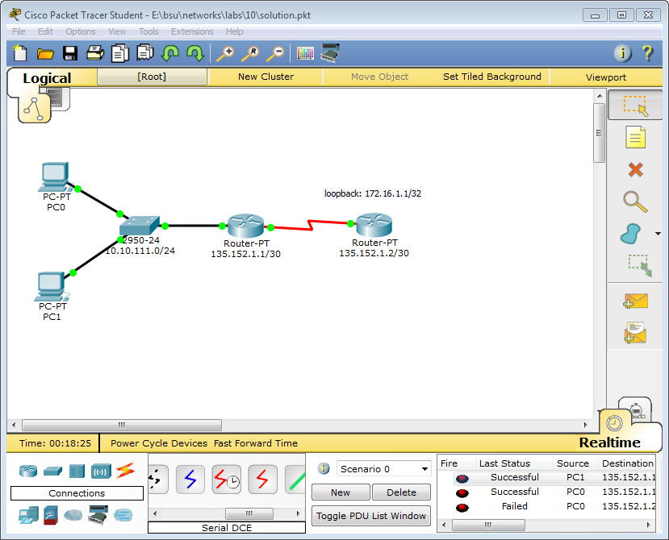
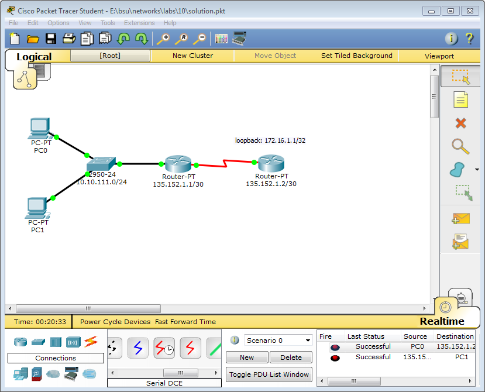
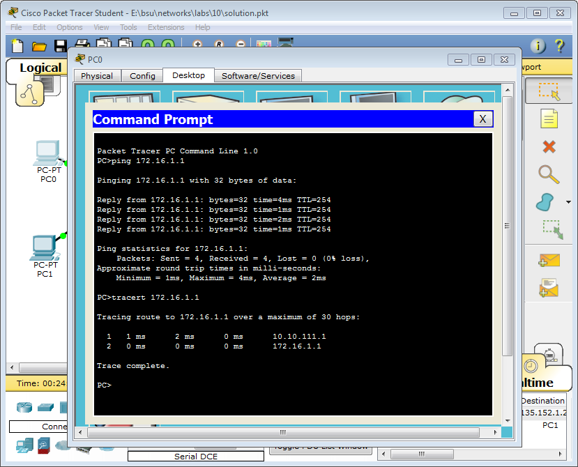

```
Router#show ip nat statistics 
Total translations: 7 (0 static, 7 dynamic, 7 extended)
Outside Interfaces: Serial2/0
Inside Interfaces: FastEthernet0/0
Hits: 7  Misses: 7
Expired translations: 0
Dynamic mappings:
-- Inside Source
access-list 1 pool public_access refCount 7
 pool public_access: netmask 255.255.255.252
       start 135.152.1.1 end 135.152.1.1
       type generic, total addresses 1 , allocated 1 (100%), misses 0


Router#show ip nat translations 
Pro  Inside global     Inside local       Outside local      Outside global
icmp 135.152.1.1:14    10.10.111.2:14     172.16.1.1:14      172.16.1.1:14
icmp 135.152.1.1:15    10.10.111.2:15     172.16.1.1:15      172.16.1.1:15
icmp 135.152.1.1:16    10.10.111.2:16     172.16.1.1:16      172.16.1.1:16
icmp 135.152.1.1:17    10.10.111.2:17     172.16.1.1:17      172.16.1.1:17
icmp 135.152.1.1:3     10.10.111.3:3      172.16.1.1:3       172.16.1.1:3
icmp 135.152.1.1:4     10.10.111.3:4      172.16.1.1:4       172.16.1.1:4
icmp 135.152.1.1:5     10.10.111.3:5      172.16.1.1:5       172.16.1.1:5
icmp 135.152.1.1:6     10.10.111.3:6      172.16.1.1:6       172.16.1.1:6
```
