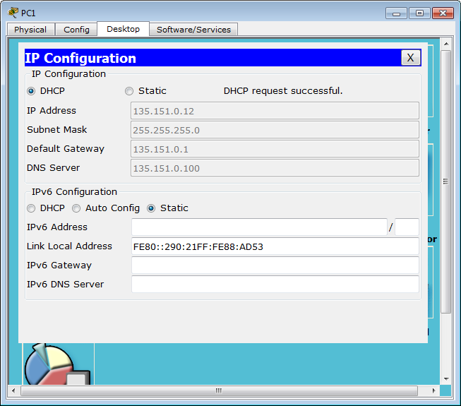
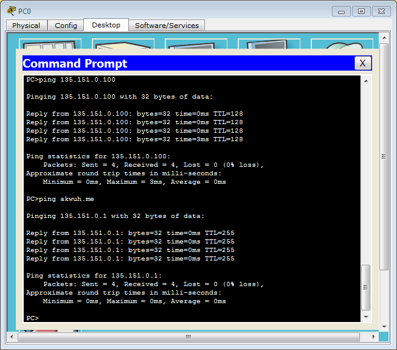
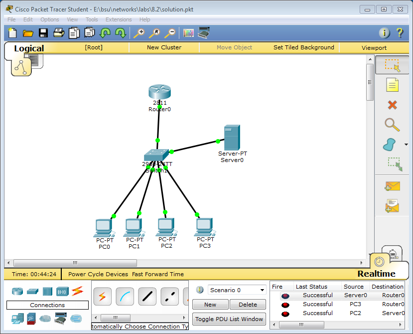

```
int f 0/0
ip address 135.151.0.1 255.255.0.0
no shutdown
exit

ip dhcp pool pool1
network 135.151.0.0 255.255.0.0
dns-server 135.151.0.100
default-router 135.151.0.1
exit
ip dhcp excluded-address 135.151.0.1 135.151.0.10
ip domain name akwuh.me
exit
```
