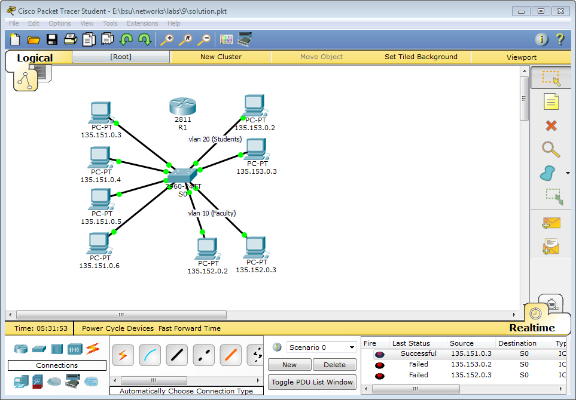
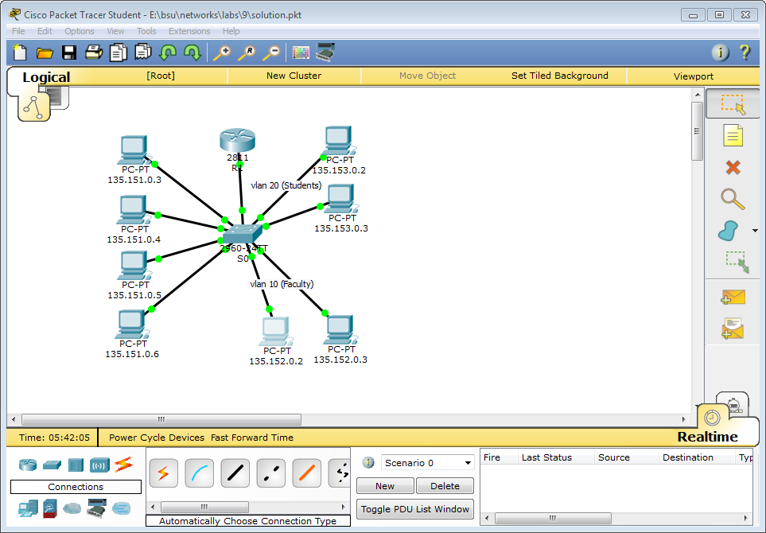

```
int vlan1
ip address 135.151.0.2 255.255.0.0
no shut
exi

vlan 10
name Faculty
exi

vlan 20
name Students
exi

ip default-gateway 135.151.0.1

int f0/5
swi mode access
swi access vlan 10
exi

int f0/6
swi mode access
swi access vlan 10
exi

int f0/7
swi mode access
swi access vlan 20
exi

int f0/8
swi mode access
swi access vlan 20
exi

exi
copy run sta
```

Finally router config:  

```
::S0
int f0/9
swi mode trunk
exi

::R1
int f0/0
ip address 135.151.0.1 255.255.0.0
no shut
exi

int f0/0.10
enc dot1q 10
ip address 135.152.0.1 255.255.0.0
exi

int f0/0.20
enc dot1q 20
ip address 135.153.0.1 255.255.0.0
exi
```

Output:  

```
Switch#show vlan brief
VLAN Name                             Status    Ports
---- -------------------------------- --------- -------------------------------
1    default                          active    Fa0/1, Fa0/2, Fa0/3, Fa0/4
                                                Fa0/9, Fa0/10, Fa0/11, Fa0/12
                                                Fa0/13, Fa0/14, Fa0/15, Fa0/16
                                                Fa0/17, Fa0/18, Fa0/19, Fa0/20
                                                Fa0/21, Fa0/22, Fa0/23, Fa0/24
                                                Gig0/1, Gig0/2
10   Faculty                          active    Fa0/5, Fa0/6
20   Students                         active    Fa0/7, Fa0/8
1002 fddi-default                     active    
1003 token-ring-default               active    
1004 fddinet-default                  active    
1005 trnet-default                    active  


Router#show ip interface brief
Interface              IP-Address      OK? Method Status                Protocol
 
FastEthernet0/0        135.151.0.1     YES manual up                    up
 
FastEthernet0/0.10     135.152.0.1     YES manual up                    up
 
FastEthernet0/0.20     135.153.0.1     YES manual up                    up
 
FastEthernet0/1        unassigned      YES unset  administratively down down
 
Vlan1                  unassigned      YES unset  administratively down down


Router#show ip route
Codes: C - connected, S - static, I - IGRP, R - RIP, M - mobile, B - BGP
       D - EIGRP, EX - EIGRP external, O - OSPF, IA - OSPF inter area
       N1 - OSPF NSSA external type 1, N2 - OSPF NSSA external type 2
       E1 - OSPF external type 1, E2 - OSPF external type 2, E - EGP
       i - IS-IS, L1 - IS-IS level-1, L2 - IS-IS level-2, ia - IS-IS inter area
       * - candidate default, U - per-user static route, o - ODR
       P - periodic downloaded static route

Gateway of last resort is not set

C    135.151.0.0/16 is directly connected, FastEthernet0/0
C    135.152.0.0/16 is directly connected, FastEthernet0/0.10
C    135.153.0.0/16 is directly connected, FastEthernet0/0.20


Switch#show interfaces trunk 
Port        Mode         Encapsulation  Status        Native vlan
Fa0/9       on           802.1q         trunking      1

Port        Vlans allowed on trunk
Fa0/9       1-1005

Port        Vlans allowed and active in management domain
Fa0/9       1,10,20

Port        Vlans in spanning tree forwarding state and not pruned
Fa0/9       1,10,20


PC>tracert 135.151.0.3

Tracing route to 135.151.0.3 over a maximum of 30 hops: 

  1   0 ms      0 ms      0 ms      135.152.0.1
  2   0 ms      0 ms      0 ms      135.151.0.3

Trace complete.
```
